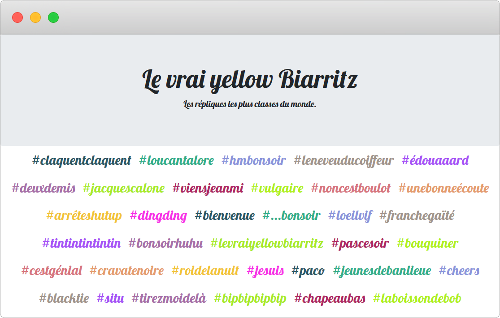

Le vrai yellow Biarritz
=======================



`le_vrai_yellow_biarritz` is a small script intended to create a collection of audio quotes as a static webpage.

## How-to

First create a virtual environment and install the necessary dependency:
```
python3 -m venv venv
. venv/bin/activate
pip install -r requirements.txt
```

Then, just point the script towards the directory where you store the audio quotes:
```
./le_vrai_yellow_biarritz /path/to/audio/quotes title subtitle
```

It will create the `index.html` inside the targeted directory.  
The example website can be found here: [https://levraiyellowbiarritz.fr](https://levraiyellowbiarritz.fr)

Thanks to [https://ouich.es](https://ouich.es) for this awesome idea.
